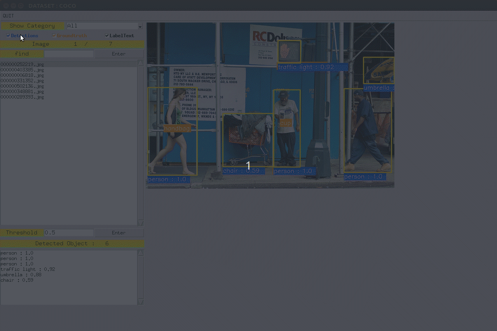

# DetVisGUI

GUI for easily visualizing object detection results .

This GUI can plot object detection results with different threshold dynamically. It would be convient for checking object detection results and groundtruth. This code supports Pascal VOC and COCO data formats.




---

**Show Pascal VOC training results:** 

```
$ python DetVisGUI.py --format VOC \
  --img_root data/VOCdevkit/VOC2007/JPEGImages \
  --anno_root data/VOCdevkit/VOC2007/Annotations \
  --txt data/VOCdevkit/VOC2007/ImageSets/Main/train.txt \
  --det_file data/VOCdevkit/voc_train_results.pkl
```

**Show Pascal VOC test results (no groundtruth):**  

add '--no_gt' if the dataset is no groundtruth.

```
$ python DetVisGUI.py --format VOC \
  --img_root data/VOCdevkit/VOC2007/JPEGImages \
  --anno_root data/VOCdevkit/VOC2007/Annotations \
  --txt data/VOCdevkit/VOC2007/ImageSets/Main/test.txt \
  --det_file data/VOCdevkit/voc_test_results.pkl \
  --no_gt
```

**Show COCO val results:** 

```
$ python DetVisGUI.py --format COCO \
  --img_root data/COCO/val2017_small \
  --anno_root data/COCO/instances_val2017_small.json \
  --det_file data/COCO/coco_val_results.pkl 
```

**Show COCO test results (no groundtruth):**  

add '--no_gt' if the dataset is no groundtruth.

```
$ python DetVisGUI.py --format COCO \
  --img_root data/COCO/test2017_small \
  --anno_root data/COCO/image_info_test-dev2017_small.json \
  --det_file data/COCO/coco_test_results.pkl \
  --no_gt
```

---

## Hotkeys

|     KEY    | ACTION                                     |
|:----------:|:------------------------------------------:|
|    ↑  ↓    | Change Image.                              |
|    →  ←    | Change detection threshold.                |
|     s      | Save plot image in output folder.          |
|     q      | Colse this GUI.                            |

