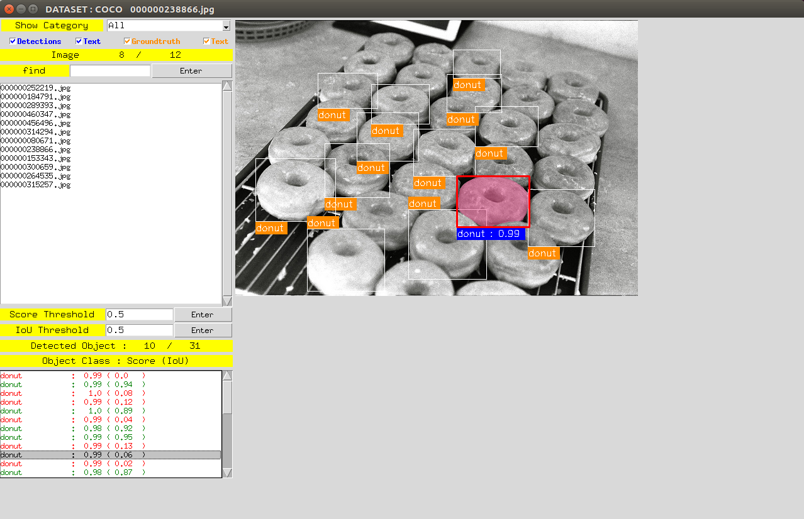
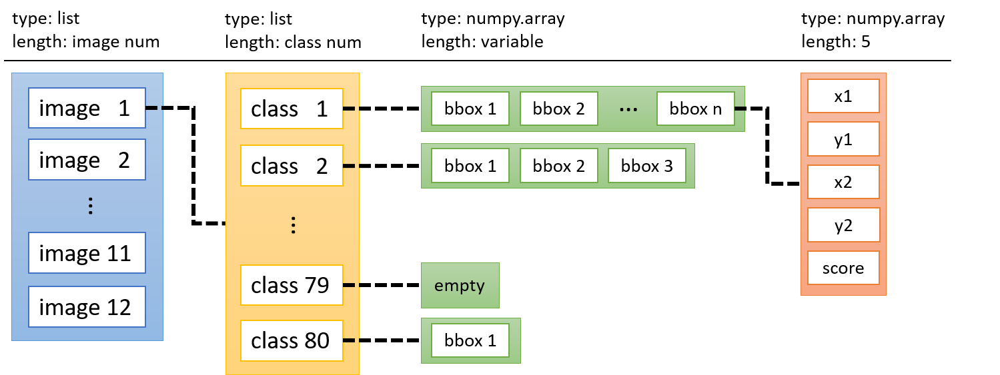

# DetVisGUI

## Introuction

This is a lightweight GUI for visualizing the results of deep learning object detection (such as [mmdetection](https://github.com/open-mmlab/mmdetection)). It could display detection results with **different threshold dynamically**, and would be convenient for verifying detection results and groundtruth. 

DetVisGUI supports **Pascal VOC** and **COCO** formats. 

[](https://www.youtube.com/watch?v=4imQyECTik0)

Video with text description : https://www.youtube.com/watch?v=4imQyECTik0

## Dependencies
- cv2
- cocoapi

```
sudo apt-get install python3-pil python3-pil.imagetk
pip install opencv-contrib-python
pip install "git+https://github.com/philferriere/cocoapi.git#egg=pycocotools&subdirectory=PythonAPI"
```

## Code

Clone this repository.

```
git clone https://github.com/Chien-Hung/DetVisGUI.git
cd DetVisGUI
```

## Demo

I sample a small part of COCO and VOC2007 dataset, running mmdetection for getting detection result(\*.pkl) and use these files for demo. There is not any information about image and annotation in the detection result(\*.pkl), so I link the image, annotation, [image list text file(VOC)] and detection result(\*.pkl) by arguments.

```
python DetVisGUI.py --format ${DATASET_FORMAT} --img_root ${IMAGE_ROOT} --anno_root ${ANNOTATION_ROOT} --txt ${IMAGE_LIST} --det_file ${DETECTION_FILE} [--output ${SAVE_DIRECTORY}] [--no_gt]
```

Arguments:

- `DATASET_FORMAT`: select dataset format, `COCO` or `VOC`.
- `IMAGE_ROOT`: The image directory.
- `ANNOTATION_ROOT`: The annotation directory (VOC) / annotation json file (COCO).
- `IMAGE_LIST`: The path of image list txt file. This argument is only for VOC format.
- `DETECTION_FILE`: The detection output file (\*.pkl). 

Optional Arguments:

- `SAVE_DIRECTORY`: The directory for saving display images.
- `--no_gt`: If there are no annotations according to display images (test images), add --no_gt.

**Display COCO validation results:** 

```
$ python DetVisGUI.py --format COCO \
      --img_root data/COCO/val2017 \
      --anno_root data/COCO/instances_val2017.json \
      --det_file results/mask_rcnn_r50_fpn_1x/val_results.pkl 
```

**Display COCO test results (no groundtruth):**

```
$ python DetVisGUI.py --format COCO \
      --img_root data/COCO/test2017 \
      --anno_root data/COCO/image_info_test-dev2017.json \
      --det_file results/mask_rcnn_r50_fpn_1x/test_results.pkl \
      --no_gt
```

**Display Pascal VOC training results:** 

```
$ python DetVisGUI.py --format VOC \
      --img_root data/VOCdevkit/VOC2007/JPEGImages \
      --anno_root data/VOCdevkit/VOC2007/Annotations \
      --txt data/VOCdevkit/VOC2007/ImageSets/Main/train.txt \
      --det_file results/ssd512_voc/train_results.pkl
```

**Display Pascal VOC test results (no groundtruth):**

```
$ python DetVisGUI.py --format VOC \
      --img_root data/VOCdevkit/VOC2007/JPEGImages \
      --anno_root data/VOCdevkit/VOC2007/Annotations \
      --txt data/VOCdevkit/VOC2007/ImageSets/Main/test.txt \
      --det_file results/ssd512_voc/test_results.pkl \
      --no_gt
```

## result(.pkl) format:


---

## Hotkeys

|     KEY    | ACTION                                    |
|:----------:|-------------------------------------------|
|   ↑ , ↓    | change image.                              |
|   ← , →    | change score threshold.                    | 
| ctrl +  ← , →    | change IoU threshold.                    | 
|     s     | save displayed image in output folder.     |
|     q     | colse this GUI.                            |

